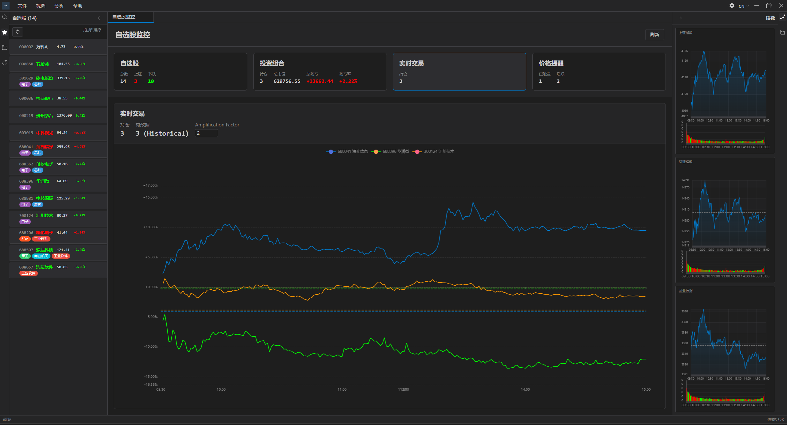
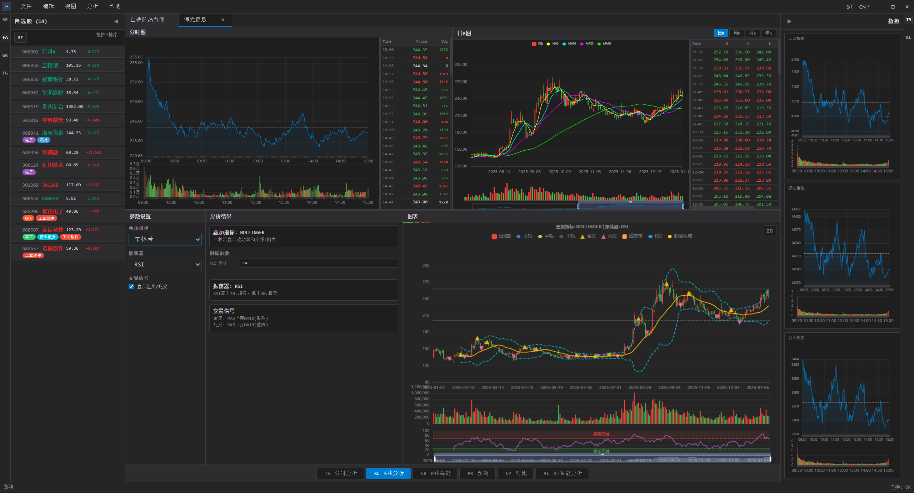
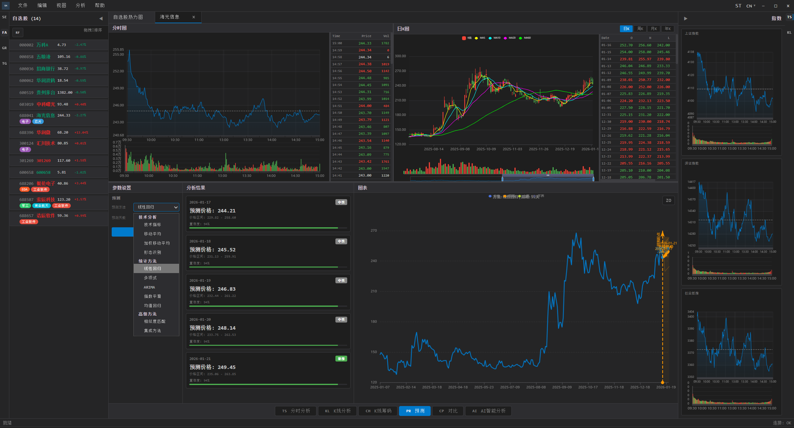
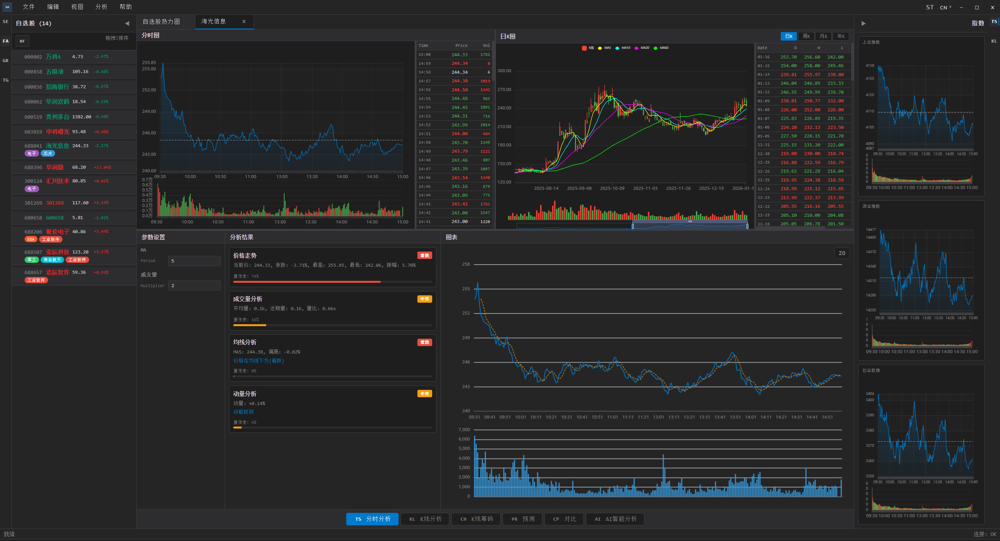
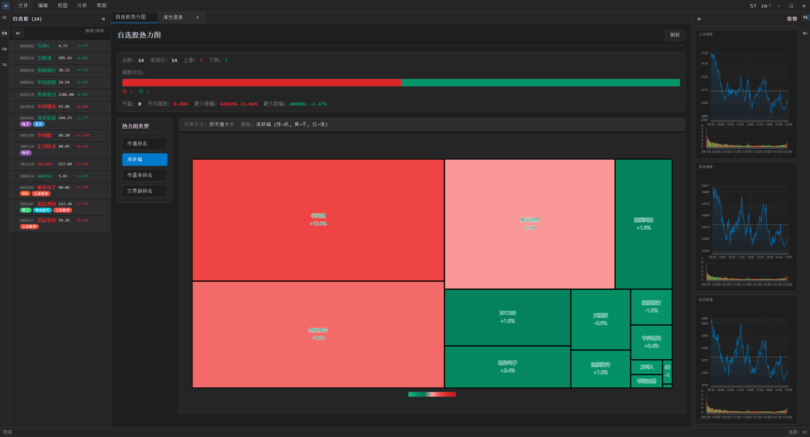
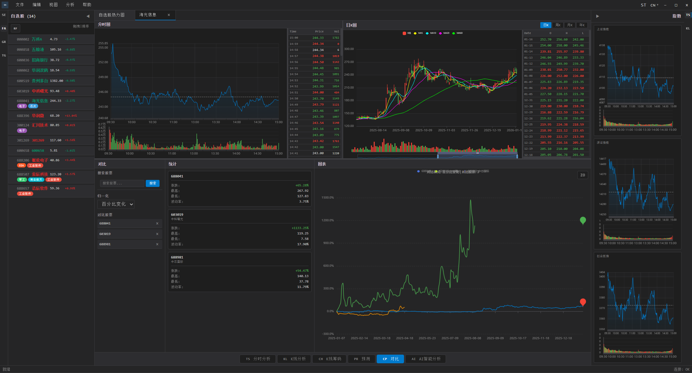

# 股票分析器

基于 Tauri 框架构建的强大多语言桌面股票分析应用。该应用提供全面的股票数据可视化、技术分析、价格预测和实时市场监控功能。

## 截图

<!-- 截图 1: 主界面 -->

*主应用界面，显示股票分析工作区*

<!-- 截图 2: K线图 -->

*带有技术指标的交互式K线图*

<!-- 截图 3: 技术分析 -->

*包含多个指标的技术分析面板*

<!-- 截图 4: 预测分析 -->

*带有置信区间的股票价格预测*

<!-- 截图 5: 收藏夹热力图 -->

*显示投资组合概览的收藏夹热力图*

<!-- 截图 6: 对比分析 -->

*多股票对比分析*

## 功能特性

### 核心功能

- **实时股票行情**: 获取最新的股票价格、成交量和市场数据
- **多语言支持**: 界面支持英语、中文和日语
- **交互式K线图**: 专业的蜡烛图，支持缩放和平移
- **技术指标**: 全面的技术分析工具，包括：
  - 移动平均线（SMA、EMA）
  - RSI（相对强弱指标）
  - MACD（移动平均收敛散度）
  - 成交量分析
  - 自定义指标参数
- **历史数据**: 查看多个时间周期的股票数据（日线、周线、月线）
- **股票搜索**: 快速搜索并添加股票到自选列表
- **收藏夹管理**: 组织和管理您关注的股票
- **数据库缓存**: 本地 SQLite 数据库，支持离线访问和快速加载

### 高级功能

- **价格预测**: 多种预测算法，包括：
  - 线性回归
  - 移动平均外推
  - 基于技术指标的预测
  - 多项式回归
  - ARIMA 模型（计划中）
- **AI智能分析**: 使用AI算法进行智能股票分析
- **对比分析**: 多股票并排对比
- **筹码分布分析**: 分析股票持仓分布
- **时间序列分析**: 详细的时间序列图表和表格
- **导出功能**: 导出分析数据和图表
- **可定制界面**: 可切换侧边栏、工具栏和全屏模式

### 用户界面

- **标签页工作区**: 多股票标签页，便于导航
- **可折叠侧边栏**: 左侧边栏显示股票列表，右侧边栏显示分析工具
- **状态栏**: 实时显示应用状态和信息
- **菜单栏**: 完整的菜单系统，支持键盘快捷键
- **设置对话框**: 自定义应用偏好设置
- **响应式设计**: 适配不同窗口尺寸

## 技术栈

### 前端
- **React 18**: 现代UI框架
- **TypeScript**: 类型安全的开发
- **Vite**: 快速的构建工具和开发服务器
- **ECharts**: 专业图表库
- **Chart.js**: 额外的图表功能
- **i18next**: 国际化框架
- **React Router**: 导航和路由

### 后端
- **Rust**: 高性能系统编程语言
- **Tauri 2.0**: 轻量级桌面应用框架
- **SQLite (rusqlite)**: 嵌入式数据库，用于数据持久化
- **Tokio**: 异步运行时，支持并发操作
- **reqwest**: HTTP客户端，用于API调用
- **serde**: 序列化框架

### 开发工具
- **Node.js**: JavaScript运行时
- **npm**: 包管理器
- **Cargo**: Rust包管理器
- **CMake**: 构建系统（用于原生依赖）

## 环境要求

在开始之前，请确保已安装以下软件：

- **Node.js**: v18.0.0 或更高版本（[下载](https://nodejs.org/)）
- **Rust**: 最新稳定版本（[安装指南](https://www.rust-lang.org/tools/install)）
- **npm**: 随 Node.js 一起安装
- **Git**: 用于克隆仓库

### Windows 额外要求

- **Microsoft Visual C++ 生成工具**: 编译 Rust 依赖项所需
- **PowerShell**: 用于运行构建脚本（Windows 10/11 已包含）

## 安装

### 1. 克隆仓库

```bash
git clone <repository-url>
cd selfa
```

### 2. 安装前端依赖

```bash
npm install
```

### 3. 安装 Tauri CLI（如果尚未安装）

```bash
npm install -g @tauri-apps/cli
```

### 4. 验证 Rust 安装

```bash
rustc --version
cargo --version
```

## 开发

### 运行开发模式

#### 方式一：Web 开发服务器（仅前端）

```bash
npm run dev
```

这将在 `http://localhost:1420`（或其他可用端口）启动 Vite 开发服务器。

#### 方式二：Tauri 开发模式（完整应用）

```bash
npm run tauri dev
```

这将构建并运行完整的 Tauri 应用，支持热重载。

#### Windows 快速启动脚本

- **start-dev.bat**: 启动开发服务器
- **start-dev-safe.bat**: 使用 PowerShell 执行策略修复启动
- **start-dev.ps1**: PowerShell 开发脚本

### 开发工作流

1. 在 `src/` 目录中修改前端代码
2. 在 `src-tauri/src/` 目录中修改后端代码
3. 开发服务器会自动重载前端更改
4. 后端更改需要重启 Tauri 应用

### 键盘快捷键

- `Ctrl+N` / `Cmd+N`: 新建文件
- `Ctrl+O` / `Cmd+O`: 打开文件
- `Ctrl+S` / `Cmd+S`: 保存文件
- `Ctrl+F` / `Cmd+F`: 查找
- `F5`: 刷新当前股票数据
- `F11`: 切换全屏

## 生产构建

### 构建前端

```bash
npm run build
```

这将编译 TypeScript 并在 `dist/` 目录中构建前端包。

### 构建 Tauri 应用

```bash
npm run tauri build
```

这将在 `src-tauri/target/release/` 中创建生产就绪的可执行文件：
- **Windows**: `.exe` 安装程序和便携式可执行文件
- **macOS**: `.dmg` 和 `.app` 包
- **Linux**: `.deb`、`.AppImage` 和其他格式

### 构建配置

构建过程在以下文件中配置：
- `vite.config.ts`: 前端构建配置
- `src-tauri/tauri.conf.json`: Tauri 应用配置
- `src-tauri/Cargo.toml`: Rust 依赖项和构建设置

## 项目结构

```
selfa/
├── src/                          # 前端 React 应用
│   ├── components/              # React 组件
│   │   ├── StockAnalysis.tsx    # 主股票分析组件
│   │   ├── KLineChart.tsx       # K线图组件
│   │   ├── KLineTechnicalAnalysis.tsx  # 技术分析
│   │   ├── PredictionAnalysis.tsx      # 预测功能
│   │   ├── FavoritesHeatmap.tsx        # 收藏夹热力图
│   │   ├── LeftSidebar.tsx      # 股票列表侧边栏
│   │   ├── RightSidebar.tsx     # 分析工具侧边栏
│   │   └── ...                  # 其他UI组件
│   ├── i18n/                    # 国际化
│   │   ├── locales/
│   │   │   ├── en.json         # 英语翻译
│   │   │   ├── zh.json         # 中文翻译
│   │   │   └── ja.json         # 日语翻译
│   │   └── index.ts            # i18n 配置
│   ├── utils/                   # 工具函数
│   │   ├── technicalIndicators.ts  # 技术指标计算
│   │   ├── chartConfigGenerator.ts # 图表配置
│   │   └── chipDistribution.ts    # 筹码分布分析
│   ├── App.tsx                  # 主应用组件
│   ├── main.tsx                 # 应用入口点
│   └── index.css                # 全局样式
│
├── src-tauri/                   # Rust 后端
│   ├── src/
│   │   ├── main.rs             # Tauri 应用入口
│   │   ├── stock_api.rs        # 股票数据API集成
│   │   └── database.rs         # 数据库操作
│   ├── Cargo.toml              # Rust 依赖项
│   ├── tauri.conf.json        # Tauri 配置
│   └── icons/                 # 应用图标
│
├── docs/                       # 文档
│   └── PREDICTION_DESIGN.md   # 预测功能设计
│
├── public/                     # 静态资源
├── dist/                       # 构建输出（自动生成）
├── package.json               # Node.js 依赖项
├── tsconfig.json              # TypeScript 配置
├── vite.config.ts             # Vite 配置
└── README.md                  # 本文件
```

## 使用指南

### 快速开始

1. **启动应用**: 运行 `npm run tauri dev` 或使用构建的可执行文件
2. **搜索股票**: 使用左侧边栏的搜索栏查找股票
3. **添加到收藏**: 点击星标图标将股票添加到收藏夹
4. **查看股票详情**: 点击股票在新标签页中打开
5. **分析**: 使用分析工具栏访问技术指标和预测功能

### 主要功能使用

#### 查看股票数据
- 从左侧边栏选择股票或搜索股票
- 股票在新标签页中打开，显示K线图和基本信息
- 使用周期选择器查看不同的时间周期（日线、周线、月线）

#### 技术分析
- 点击分析工具栏中的"技术指标"按钮
- 选择要在图表上显示的指标
- 在设置面板中调整指标参数
- 在分析结果面板中查看指标值

#### 价格预测
- 点击分析工具栏中的"预测"按钮
- 选择预测方法（线性回归、移动平均外推等）
- 选择预测周期（5天、10天、30天）
- 在图表上查看带有置信区间的预测价格

#### 收藏夹热力图
- 默认标签页显示所有收藏股票的热力图
- 颜色表示价格变化（绿色上涨，红色下跌）
- 点击任意单元格查看详细股票信息

#### 对比分析
- 选择多个股票进行对比
- 使用对比分析功能查看并排对比
- 分析相对表现和趋势

### 数据库

应用使用 SQLite 进行本地数据存储：
- 股票行情缓存用于离线访问
- 历史K线数据本地存储
- 收藏夹和用户偏好持久化保存
- 数据库文件位置：应用数据目录（由 Tauri 管理）

## 配置

### 应用设置

通过标题栏中的设置按钮访问设置：
- **自动刷新**: 启用自动数据刷新
- **刷新间隔**: 设置刷新频率（秒）
- **主题**: 在深色和浅色主题之间切换
- **语言**: 更改应用语言

### API 配置

股票数据从外部 API 获取。API 端点和配置在 `src-tauri/src/stock_api.rs` 中定义。

## 故障排除

### 常见问题

#### Windows 构建错误
- 确保已安装 Microsoft Visual C++ 生成工具
- 运行 `rustup update` 确保 Rust 是最新的
- 尝试以管理员权限运行 `npm run tauri build`

#### 端口已被占用
- 开发服务器默认使用端口 1420
- 如果端口被占用，Vite 会自动使用下一个可用端口
- 或使用 `kill-port.bat` 脚本释放端口

#### PowerShell 执行策略
- 如果遇到执行策略错误，运行 `fix-execution-policy.ps1`
- 或以管理员身份运行 PowerShell 并设置：`Set-ExecutionPolicy RemoteSigned`

#### 数据库错误
- 如果数据库操作失败，应用将创建新数据库
- 可能需要清除旧的缓存数据（删除数据库文件）

### 获取帮助

- 检查控制台中的错误消息
- 查看 `docs/` 目录中的文档
- 确保所有依赖项已正确安装
- 验证网络连接以进行 API 调用

## 贡献

欢迎贡献！请遵循以下指南：

1. Fork 仓库
2. 创建功能分支（`git checkout -b feature/amazing-feature`）
3. 进行更改
4. 充分测试
5. 提交更改（`git commit -m 'Add amazing feature'`）
6. 推送到分支（`git push origin feature/amazing-feature`）
7. 打开 Pull Request

### 代码风格

- **前端**: 遵循 React 和 TypeScript 最佳实践
- **后端**: 遵循 Rust 约定并使用 `rustfmt`
- **注释**: 代码注释使用英文
- **提交消息**: 使用清晰、描述性的提交消息

## 路线图

### 计划功能

- [ ] ARIMA 模型预测实现
- [ ] LSTM 神经网络预测
- [ ] 投资组合管理和跟踪
- [ ] 价格阈值提醒系统
- [ ] 导出到 Excel/CSV
- [ ] 自定义指标创建
- [ ] 回测功能
- [ ] 移动应用版本
- [ ] 收藏夹和设置的云同步

## 许可证

[在此指定您的许可证]

## 致谢

- 使用 [Tauri](https://tauri.app/) 构建
- 图表由 [ECharts](https://echarts.apache.org/) 和 [Chart.js](https://www.chartjs.org/) 提供支持
- 股票数据来自各种金融 API

## 联系方式

[添加联系信息或问题/支持链接]

---

**注意**: 本应用仅供教育和研究用途。股票市场预测和分析不应被视为财务建议。在进行投资决策之前，请务必咨询合格的财务顾问。
